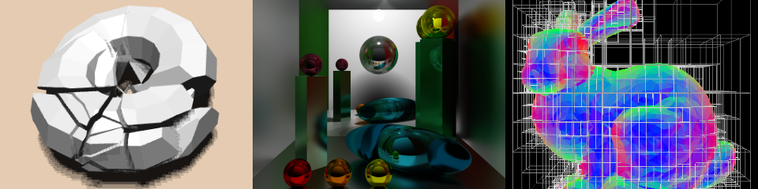

Course website for CIS 565 at the University of Pennsylvania

[http://seas.upenn.edu/~cis565/](http://seas.upenn.edu/~cis565/)

# Course Schedule

 Date | Topic | Reading
 ---- | ----- | -------
08/31 | [Course overview](lectures/0-Course-Overview.pptx?raw=true) :small_blue_diamond: [CUDA crash course](lectures/1-CUDA-Introduction-1.pptx?raw=true) | PMPP Chapters 3
09/08 (**Tuesday, 6-9pm, Towne 309**) | [Parallel algorithms](lectures/2-Parallel-Algorithms.pptx?raw=true) :small_blue_diamond: Parallel Nsight :small_blue_diamond: [GPU architecture](3-GPU-Architecture-Overview.pptx?raw=true) | [Parallel Prefix Sum (Scan) with CUDA](http://http.developer.nvidia.com/GPUGems3/gpugems3_ch39.html) :small_blue_diamond: [Modern Microprocessors. A 90 Minute Guide!](http://www.lighterra.com/papers/modernmicroprocessors/) :small_blue_diamond: PMPP Chapter 1
09/14 | [CUDA: Part 2](4-CUDA-Introduction-2-of-2.pptx?raw=true) :small_blue_diamond: [README.md Tips](6-README-Tips.pptx?raw=true) :small_blue_diamond: Path Tracing: [Part 1](4.1-Path-Tracing-1.pdf?raw=true), [Part 2](4.2-Path-Tracing-2.pdf?raw=true) | PMPP Chapters 4 and 5 :small_blue_diamond: [How to make an attractive GitHub repo](https://github.com/pjcozzi/Articles/tree/master/CIS565/GitHubRepo)
09/21 | [CUDA Performance](7-CUDA-Performance.pptx?raw=true)  :small_blue_diamond: [Parallel algorithms: Part 2](5-Parallel-Algorithms-2.pptx?raw=true) | PMPP Chapter 6
**09/30 (Wednesday, Moore 212)** | [Graphics Pipeline: 1 of 2](09-Graphics-Pipeline.pptx?raw=true) :small_blue_diamond: [CUDA Atomics](8-CUDA-Atomics.pptx?raw=true) | RTR Chapters 1 and 2
10/05 | Graphics Pipeline: 2 of 2 :small_blue_diamond: [Mobile Graphics](10-Mobile-Graphics.pptx?raw=true) | [OpenGL Insights Chapter 23](http://www.seas.upenn.edu/~pcozzi/OpenGLInsights/OpenGLInsights-TileBasedArchitectures.pdf)
10/12 | [GLSL](11-GLSL.pptx?raw=true) :small_blue_diamond: [Ray Marching](12-Ray-Marching.pptx?raw=true) | [Numerical Methods for Ray Tracing Implicitly Defined Surfaces](http://graphics.cs.williams.edu/courses/cs371/f14/reading/implicit.pdf)
10/19 | [WebGL](lectures/13-WebGL.pptx?raw=true) :small_blue_diamond: [Deferred Shading](lectures/14-Deferred-Shading.pptx?raw=true) |  :small_blue_diamond: [WebGL Debugging and Profiling Tools](http://www.realtimerendering.com/blog/webgl-debugging-and-profiling-tools/) :small_blue_diamond: [code examples](webgl-examples) :small_blue_diamond: [WebGL Deferred Shading](https://hacks.mozilla.org/2014/01/webgl-deferred-shading/)
10/26 | [WebGL Profiling Lab](https://github.com/CIS565-Fall-2015/WebGL-Profiling-Lab) | -
11/02 | [Tangram Insights](http://tangrams.github.io/tangram-sandbox/slides/#/). Patricio Gonzalez Vivo, Mapzen :small_blue_diamond: [Final Project Kickoff](https://github.com/CIS565-Fall-2015/Final-Project) | -
**11/10 (Tuesday, SIG lab)** | Final Project Pitches | -
11/16 (**5pm, SIG lab conference room**) | [WebGL in Production: Content, Rendering and Integration in the BioDigital Human](http://tsherif.github.io/upenn-biodigital/#/). Tarek Sherif, BioDigital | -
11/23 | Dave Kotfis, Lockheed Martin | -
11/30 | Accelerating Watson Workloads - Enhancing, scaling, and accelerating human expertise. Tim Kaldewey, IBM Research | -
12/07 (Last day of class)       | [Graphics API Wrangling with ANGLE](https://docs.google.com/presentation/d/1vN_KTFDaKjFlIgx1vM3ZFA4Rkf723onAAhIfKR7kmgA/edit?usp=sharing). Shannon Woods, Google | -
12/11 (Friday, 5pm, Moore 212) | - | -

# Course Projects

* P0 - [CUDA getting started](https://github.com/CIS565-Fall-2015/Project0-CUDA-Getting-Started), due Wednesday, September 2.
* P1 - [N-body simulation](https://github.com/CIS565-Fall-2015/Project1-CUDA-Introduction), due Monday, September 7.
* P2 - [Stream compaction](https://github.com/CIS565-Fall-2015/Project2-Stream-Compaction/blob/master/README.md), due Sunday, September 13.
* P3 - [GPU path tracer](https://github.com/CIS565-Fall-2015/Project3-CUDA-Path-Tracer), due Tuesday, September 29.
* P4 - [GPU rasterizer](https://github.com/CIS565-Fall-2015/Project4-CUDA-Rasterizer), due Sunday, October 11.
* P5 - [WebGL ray marcher](https://github.com/CIS565-Fall-2015/Project5-GLSL-Ray-Marcher), due Monday, October 19.
* P6 - [WebGL deferred shader](https://github.com/CIS565-Fall-2015/Project6-WebGL-Deferred-Shading), due Tuesday, October 27
* P7 - OpenGL compute shader

# Bonus Slides

Material from previous semesters that we did not cover:

* [CUDA Profiling and Debugging](http://cis565-fall-2014.github.io/lectures/09-22-CUDA-Profiling-and-Debugging.pptx) by Zakiuddin Shehzan Ayub Mohammed, ArrayFire
* [CUDA Odds and Ends](http://cis565-fall-2013.github.io/lectures/10-02-CUDA-Odds-and-Ends.pptx)
* [SSAO](http://cis565-fall-2014.github.io/lectures/11-03-Ambient-Occlusion.pptx)
* [Shadows](http://cis565-fall-2014.github.io/lectures/10-27-Shadows.pdf) by Sean Lilley
* [Z-Buffer Optimizations](http://cis565-fall-2013.github.io/lectures/11-06-Z-Buffer-Optimizations.pptx)
* [OpenGL Buffer Transfers](http://cis565-spring-2012.github.io/lectures/03-28-OpenGL-Buffer-Transfers.pptx)
* [glTF and Rest3D](http://cis565-fall-2013.github.io/lectures/12-04-glTF-and-rest3d.pptx) (also see [here](https://github.com/KhronosGroup/glTF#presentations-and-articles))
* [Modern GPU Architectures](http://cis565-spring-2012.github.io/lectures/04-18-Modern-GPUs.pptx) (modern in 2012) by Varun Sampath
* [Perspectives on Mobile Graphics, OpenGL, and the Future of Graphics Programming](http://cis565-fall-2012.github.io/lectures/11-12-Graphics-Mobile-APIs-Life.pdf) by Dave Shreiner
